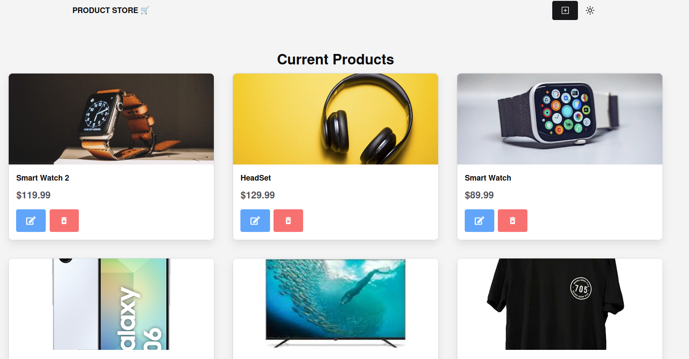

# Project from Free Code Camp

>Objective: Create an organized application that connects to MongoDB and performs 4 basic CRUD operations with a frontend that updates in real time.

| Technologies used  |     |  
| -------------      | ------------- |  
| Back-end           | Node.js, Express       | 
| Front-end          | React, Chacka.ui, Zustand | 
| Database           | MongoDB         | 
| Plataform          | [X] Web  [] Android [ ] Desktop      |